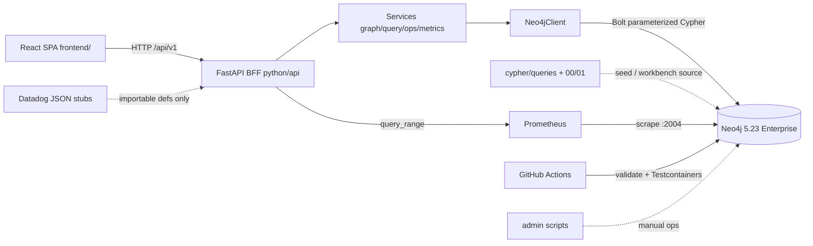
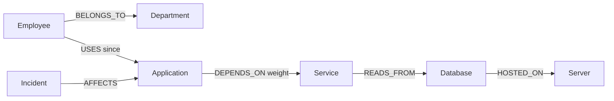
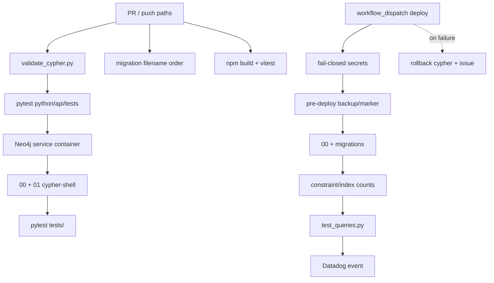

# PROJECT_HANDOFF — Neo4j Enterprise Assessment

> **Authority:** reverse-engineered from the repository (not from plans).  
> **Legend:** **ACTUAL** = runnable code/config · **DOCUMENTED** = markdown/scripts not wired into default lab runtime · **INFERRED** = reasonable conclusion from code · **NOT IMPLEMENTED** = absent.  
> **Interview posture:** present the system **from the frontend** (“Topology Signal Room”); use each view to unlock Neo4j modeling, Cypher, performance, DBA, and CI stories.

---

## 1. Project Overview

| | |
|---|---|
| **Purpose** | Model enterprise IT dependencies so responders can answer “what breaks if this database/service fails?” — people ← apps ← services ← databases ← servers, with incidents. |
| **Core capabilities** | Idempotent Neo4j 5.23 lab graph (~38 nodes / 45 rels); Q1–Q9 parameterized Cypher; typed Python driver; FastAPI BFF; React ops console; Prometheus scrape; Datadog alert/dashboard stubs; admin scripts; GitHub Actions CI + manual deploy. |
| **Stack** | Neo4j 5.23 Enterprise (APOC+GDS in Compose), Python 3.12 + neo4j driver + FastAPI, React 19 + Vite 8 + Cytoscape + Recharts, Docker Compose, Prometheus, GitHub Actions. |
| **Components** | `frontend/` SPA → `python/api/` BFF → `python/neo4j_client.py` → Neo4j; parallel: `cypher/`, `admin/`, `monitoring/`, `tests/`, `.github/workflows/`, `architecture/` (scale design). |

**30 seconds:** “This is a Neo4j DBA assessment turned into an operations console. A dependency graph links employees to apps to services to databases to servers. The UI shows blast radius, incidents, allowlisted Cypher, and DBA metrics — without exposing Bolt to the browser.”

**2 minutes:** Lab seed is small but honest (38/45). Nine assessment queries prove indexing, DISTINCT blast-radius counting, bounded variable-length paths, and aggregations. A FastAPI BFF wraps the typed client and allowlists workbench execution. Compose runs single-node Neo4j + Prometheus + API + UI. HA (3-core Raft), 5M/100M scale, Datadog agent, and RBAC application are **documented/stubbed**, not the default live cluster. Interview story: frontend demo → open Cypher/plan badges → point at constraints/indexes/ops scripts.

---

## 2. Actual Architecture



**Runtime flows (once):**

1. **Read path:** UI TanStack Query → `endpoints.*` → BFF router → service → `Neo4jClient.execute_read` → records → camelCase DTOs → JSON.  
2. **Workbench write-shaped but safe:** `POST /queries/{id}/execute` only; catalog maps ID → Cypher file production block; unknown IDs / extra params rejected. `API_READ_ONLY=true` blocks other POSTs.  
3. **Seed:** Compose Neo4j → operator runs `00_constraints_indexes.cypher` then `01_sample_data.cypher` via cypher-shell (not auto-seeded by Compose). CI seeds via Testcontainers + cypher-shell.  
4. **Metrics:** Neo4j Prometheus endpoint → Prometheus → BFF `MetricsService` → Operations page (unknown if PromQL empty — never fake zeros).

**Compose services (ACTUAL):** `neo4j`, `prometheus`, `api`, `frontend` (`docker-compose.yml`).

---

## 3. Repository Map

| Path | Purpose | Critical details |
|---|---|---|
| `cypher/00_constraints_indexes.cypher` | Lab schema | 12 constraints; range indexes incl. `idx_dept_name` |
| `cypher/01_sample_data.cypher` | Idempotent seed | MERGE/ON CREATE/ON MATCH; 38/45 |
| `cypher/queries/q1`–`q9_*.cypher` | Assessment queries | PRODUCTION + TEST + EXPLAIN comments |
| `cypher/migrations/` | Schema migrations | `v1.0.0__add_department_name_index` + rollback + `migration_log.md` |
| `cypher/performance/` | Tuning teaching | `explain_profile_analysis.cypher`, `query_tuning_notes.md` |
| `python/neo4j_client.py` | Driver wrapper | `execute_read`/`execute_write`, retries, pool |
| `python/queries.py` | Typed Q helpers | 10 functions wrapping Cypher constants |
| `python/models.py` | Frozen DTOs | `from_record` / `to_dict` |
| `python/exceptions.py` | Error taxonomy | Connection/Query/Timeout/Data |
| `python/api/main.py` | FastAPI app | Lifespan client, CORS, read-only middleware |
| `python/api/routers/*` | HTTP surface | health, overview, graph, applications, queries, operations |
| `python/api/services/*` | Domain logic | `GraphService`, `QueryService`, `query_catalog`, `MetricsService`, `OperationsService` |
| `frontend/src/` | Ops console | Routes, pages, Cytoscape, Recharts, API client |
| `admin/` | DBA tooling | `backup.sh`, `restore.sh`, `cluster_health_check.sh`, `rbac_setup.cypher`, runbook |
| `monitoring/` | Observability artifacts | `prometheus.yml`, Datadog JSON, `metrics_catalog.md` |
| `tests/` | Integration | Testcontainers Neo4j; query/constraint/perf/client |
| `.github/workflows/` | CI/CD | `neo4j-validate.yml`, `neo4j-deploy.yml` (`workflow_dispatch`) |
| `architecture/` | Scale design | `SCALE_DESIGN.md`, `scale_model.cypher` — **not** lab seed |
| `docs/` | Narrative | HA, PERFORMANCE, GRAPH_MODEL, CONSOLE |
| `docker-compose.yml` | Local stack | Single-node Neo4j + Prom + API + UI |

---

## 4. Neo4j Graph Model

### Lab labels & identifiers (ACTUAL)

| Label | Identifier | Other properties |
|---|---|---|
| Department | `deptId` | name, budget, headcount, costCenter |
| Employee | `employeeId` | name, email, role, hireDate |
| Application | `applicationId` | name, version, owner, tier, description |
| Service | `serviceId` | name, type, port, protocol, sla_ms |
| Database | `databaseId` | name, engine, version, size_gb, env, replication |
| Server | `serverId` | name, ip, region, az, os, cpu_cores, ram_gb |
| Incident | `incidentId` | title, severity, status, ts, resolvedTs, mttr_minutes |

### Relationships (ACTUAL)

| Type | From → To | Rel props | Sample edges |
|---|---|---|---|
| BELONGS_TO | Employee → Department | — | 10 |
| USES | Employee → Application | `since` | 11 |
| DEPENDS_ON | Application → Service | `weight` (0–1) | 7 |
| READS_FROM | Service → Database | — | 6 |
| HOSTED_ON | Database → Server | — | 3 |
| AFFECTS | Incident → Application | — | 8 |

`EXTENDS` appears in scale docs / UI meta as scale-only (**0 lab edges**).



### Constraints & indexes (ACTUAL)

- **7 uniqueness** on all `*Id` fields.  
- **5 existence** (NOT NULL): Employee email/name, Incident severity/status, Application name.  
- **Range indexes:** Incident severity/status/ts + composite (severity,status); Application tier/owner; Employee role/email; Database env/engine; Server region; Service type; Department name (`idx_dept_name`). Uniqueness constraints also create backing indexes.

### Modeling decisions

| Decision | Why |
|---|---|
| Incident is a **node** + AFFECTS, not a property on Application | Supports timeline, severity/status filters, many incidents per app |
| DEPENDS_ON.weight on relationship | Criticality without duplicating Service nodes |
| USES.since on relationship | Temporal edge semantics |
| MERGE + ON CREATE/ON MATCH | Idempotent seed; safe re-run |
| Unique business IDs | NodeIndexSeek entry points for Q2/Q4/Q5/Q9 |
| Graph vs SQL | Variable-depth blast radius and multi-path DISTINCT are natural in Cypher |

**Scale (DOCUMENTED only):** `architecture/scale_model.cypher` adds Component/Team/Customer, EXTENDS, APOC blast-radius jobs — **not** applied by Compose/CI seed.

---

## 5. Cypher & Query Logic

| Q | Location | Purpose | Key logic | Perf note |
|---|---|---|---|---|
| Q1 | `cypher/queries/q1_finance_apps.cypher` | Apps by department users | Dept → Emp → App; collect users | Prefer dept index; label+name filter |
| Q2 | `q2_employee_chain.cypher` | Emp chain | Emp-USES-App-DEPENDS_ON-Svc-READS_FROM-DB | Anchor `employeeId` → NodeIndexSeek |
| Q3 | `q3_high_incident_apps.cypher` | High-incident apps | Aggregate incidents then filter | Filter **after** aggregation |
| Q4 | `q4_db_impact_analysis.cypher` | DB blast radius | Inbound DB←Svc←App←Emp | DISTINCT people; multi-path rows remain |
| Q5 | `q5_dependency_paths.cypher` | App→DB paths | `DEPENDS_ON*1..3` then READS_FROM | Bound variable length; no unbounded `*` |
| Q6 | `q6_top_apps_by_users.cypher` | Top apps by users | count DISTINCT; LIMIT | Tie-break `applicationId ASC` |
| Q7 | `q7_shared_db_employees.cypher` | Shared-DB exposure | collect apps per emp+db; size≥min | Lab often **empty** at minApps=2 (intentional) |
| Q8 | `q8_no_incidents.cypher` | Clean apps as-of | NOT EXISTS AFFECTS with ts cutoff | Uses Incident.ts; `$asOf` nullable |
| Q9 | `q9_full_downstream_chain.cypher` | Full downstream | App→Svc→DB→Server + weight | Named rels for weight ORDER BY |

**Concepts used:** parameterized `$params`, unique-index seeks, Expand, DISTINCT, EagerAggregation, AntiSemiApply/NOT EXISTS, VarLengthExpand with upper bound, post-aggregation WHERE, ORDER BY + LIMIT.

**Workbench:** production Cypher loaded from files via `python/api/services/query_catalog.py` (strips to first PRODUCTION block).

---

## 6. Performance

**ACTUAL strategy**

- Unique constraints → seek entry points (`tests/test_performance.py` asserts NodeIndexSeek, not label scan).  
- Range indexes for filters/ORDER BY.  
- Bound path depth in Q5 (`*1..3`).  
- DISTINCT for people counts in Q4.  
- Teaching artifacts: `cypher/performance/*`, `docs/PERFORMANCE_ANALYSIS.md` (EXPLAIN vs PROFILE).  
- Compose memory: heap 4g, pagecache 2g; query log threshold 2000ms; tx timeout 60s.  
- Monitoring thresholds: p95 2s/5s; page cache &lt;97%/&lt;95%; heap 80%/90%.

**As graph grows (INFERRED from design docs)**

- Lab Q4 expands inbound — fine at 45 edges; at 100M edges need precompute / APOC subgraph / read replicas (**DOCUMENTED** in `SCALE_DESIGN.md`, not lab-coded).  
- Unbounded `*` would explode cardinality — project explicitly forbids it in Q5 comments.  
- Page cache should cover working set; monitoring gauges expose hit ratio.

| Implemented | Recommended at scale (DOCUMENTED) |
|---|---|
| Indexes + seek-first queries | Tier-1 blast-radius precompute |
| Bounded var-length | Dedicated analytics replicas |
| EXPLAIN teaching queries | PROFILE on prod-like data; memory tx limits |

---

## 7. DBA / Production Operations

| Area | Status | Location |
|---|---|---|
| Schema | **ACTUAL** | `cypher/00_constraints_indexes.cypher` |
| Migrations | **ACTUAL** (1 migration) | `cypher/migrations/v1.0.0__*` + deploy workflow |
| Health checks | **ACTUAL** script | `admin/cluster_health_check.sh` (7 checks; expects ≥3 members for cluster — fails that check on single-node unless role omitted) |
| Backup/restore | **ACTUAL** scripts | `admin/backup.sh`, `admin/restore.sh` — **not** scheduled in Compose |
| Config | **ACTUAL** | Compose env + `.env.example` |
| Troubleshooting | **DOCUMENTED** | `admin/troubleshooting_runbook.md`; UI RunbookStepper reads curated steps from API |
| Security/RBAC | **ACTUAL** script, **not applied** by seed | `admin/rbac_setup.cypher` |
| HA/cluster | **DOCUMENTED** | `docs/HA_CLUSTERING.md`; lab is single-node `bolt://` |
| Upgrades | **DOCUMENTED** | Rolling upgrade procedure in HA doc |

---

## 8. ETL & Data Pipeline

```text
01_sample_data.cypher (hand-authored)
  → MERGE nodes by business ID
  → ON CREATE SET / ON MATCH SET properties
  → MATCH endpoints → MERGE relationships
  → verification comments (counts)
```

| Concern | Approach |
|---|---|
| Duplicates | MERGE on unique IDs; uniqueness constraints |
| Transactions | cypher-shell statement batches; CI applies full files |
| Batching at scale | **DOCUMENTED** (`apoc.periodic.iterate`, `CALL {} IN TRANSACTIONS`) — not used in lab seed |
| Validation | CI count checks; `SHOW CONSTRAINTS` count = 12 |

No external ETL framework (Spark/Kafka) — seed **is** the pipeline for assessment.

---

## 9. Python / API

**Driver:** `Neo4jClient` — verify_connectivity, managed read/write, retries on transient, custom exceptions.

**Query layer:** `python/queries.py` — `$parameters` only; typed models.

**API:** FastAPI lifespan creates one client; routers under `/api/v1`; services serialize Neo4j types (`serialization.py`); errors → 503/504/400/500 with `requestId`.

**Representative request (Impact):**

1. UI `ImpactAnalysisPage` → `GET /api/v1/databases/DB-001/impact`  
2. `QueryService.database_impact` → `get_impacted_employees` → Q4 Cypher  
3. Records → `ImpactedEmployeeDTO` + summary (unique employees, apps, services, departments, pathRowCount)  
4. Parallel `GET .../applications/APP-001/paths/DB-001` → Q5 paths  
5. UI pie + path list + evidence table  

**Allowlist:** `query_catalog.validate_parameters` rejects unknown query IDs and unexpected keys.

---

## 10. Frontend (presentation surface — DETAIL)

Present the project **as a product**: Topology Signal Room console. Every Neo4j claim should be **shown on a screen**, then backed by Cypher/file references if challenged.

### Stack & shell (ACTUAL)

| Item | Detail |
|---|---|
| App | React 19, Vite 8, TS; `frontend/src/App.tsx` = ErrorBoundary → QueryClient → Router |
| Routes | `/`, `/graph`, `/impact`, `/applications`, `/operations`, `/queries/:queryId` (`router.tsx`) |
| Data | TanStack Query (staleTime 20s); Zustand `graphStore` for graph filters/selection |
| API | `api/client.ts` + `endpoints.ts`; `VITE_API_BASE_URL=http://localhost:8000/api/v1` |
| Visual | Cytoscape+dagre (topology); Recharts (impact pie, ops lines, workbench bars) |
| Design | `styles/tokens.css` — warm mineral + chartreuse signal; IBM Plex Sans / Space Grotesk |
| Layout | `AppShell` + `Sidebar` (“Topology Signal Room”) + `TopBar` (“Live API /api/v1”) + `PageContainer` |

**Bug fixed (ACTUAL):** `withQuery` previously returned `/api/v1/...` paths that `apiFetch` prefixed again → 404 `/api/v1/api/v1/...`. Now builds relative pathnames only (`frontend/src/api/client.ts`).

### View-by-view: SHOW / SAY / Neo4j proof

#### A. Overview `/` — `OverviewPage.tsx`

| | |
|---|---|
| **API** | `GET /overview` |
| **SHOW** | Cards: nodes, relationships, applications, incidents, active; **separate** scale strip (5M/100M, P90 targets); DB-001 scenario ribbon; high-risk app (FinanceSuite incidents); links to Impact/Graph/Ops/Queries |
| **SAY** | “Lab facts vs production target — we never pretend 38 nodes is 5M.” |
| **Proves** | Honesty about scale; entry to blast-radius narrative |
| **Demo click** | “Open impact analysis” → `/impact?databaseId=DB-001&applicationId=APP-001` |

If seed missing: EmptyState with schema/data guidance (not fake 38).

#### B. Graph `/graph` — `GraphExplorerPage.tsx`

| | |
|---|---|
| **API** | `GET /graph?labels=...` |
| **SHOW** | Cytoscape canvas; label chips; layout dagre/circle/concentric; legend counts; inspector JSON properties |
| **SAY** | “Property graph: typed nodes and directed relationships. Incidents are nodes. DEPENDS_ON carries weight.” |
| **Proves** | Modeling; relationship direction; topology as ops artifact |
| **Demo** | Filter to Application+Service+Database; switch concentric; click FinanceSuite; read `applicationId`/`tier` in inspector |

**Gaps (be honest):** relationship-type chips / tier filters exist in Zustand but little UI; `nodeDetail` endpoint unused; edge-weight hover not implemented; TopBar search is decorative.

#### C. Impact `/impact` — `ImpactAnalysisPage.tsx` ⭐ primary demo

| | |
|---|---|
| **API** | catalogs; `GET /databases/{id}/impact` (Q4); `GET /applications/{app}/paths/{db}` (Q5) |
| **URL** | `?databaseId=&applicationId=` |
| **SHOW** | Metrics: unique people, apps, services, path evidence rows; pie; Q5 hop lists; employee evidence table; **Simulate failure** (visual outline/colors only) |
| **SAY** | “Indexed database seek, inbound expand. Unique people ≠ path rows — DISTINCT vs multi-path evidence. Simulation never writes.” |
| **Proves** | Cypher blast radius; DISTINCT semantics; bounded paths |
| **Expected lab** | DB-001 → ~4 unique employees, FinanceSuite, 2 services, 2 hop-count-2 paths |

#### D. Applications `/applications` — `ApplicationHealthPage.tsx`

| | |
|---|---|
| **API** | top-by-users (Q6), high-incidents (Q3), incidents, downstream (Q9), no-incidents (Q8) |
| **URL** | `applicationId`, `asOf`, `minIncidents` auto-synced |
| **SHOW** | Risk rail; incident timeline; clean-app cards; downstream table (svc/db/server + criticality) |
| **SAY** | “FinanceSuite concentrates incidents and depends on auth-service weight 1.0 / reporting 0.8 into DB-001/SRV-001. HRConnect/AlertManager are clean as-of far future.” |
| **Proves** | Aggregation, temporal incident filter, full downstream chain |

#### E. Operations `/operations` — `OperationsPage.tsx`

| | |
|---|---|
| **API** | summary, metrics (15s poll), alerts, runbook |
| **SHOW** | Mode/health/constraint/index counts; line charts; members; Datadog-derived alerts; runbook commands |
| **SAY** | “Standalone lab labeled as such; production target called out. Metrics show unknown if Prometheus series missing — no fake green.” |
| **Proves** | DBA posture, monitoring thresholds, runbook discipline |

#### F. Query Workbench `/queries/:queryId` — `QueryWorkbenchPage.tsx` ⭐ proof layer

| | |
|---|---|
| **API** | `GET /queries`, `GET /queries/{id}`, `POST .../execute` |
| **SHOW** | Q1–Q9 navigator; **expected operator badges**; read-only Cypher; params; execute; table + bar chart; Q7 positive-empty copy |
| **SAY** | “Same Cypher files as assessment. Allowlisted IDs only. Operators tell the plan story without pasting EXPLAIN every time.” |
| **Proves** | Parameterization, Cypher safety, performance vocabulary, measured `executionMs` |

**Default demo query:** `/queries/q4` with `databaseId=DB-001`.

### Endpoints defined but unused by pages (ACTUAL)

`health`, `metaModel`, `catalogEmployees`, `departmentApplications`, `employeeDependencyChain`, `sharedDatabaseExposure`, `nodeDetail` — available for deeper demos via API docs (`:8000/docs`) if asked.

### Frontend tests (ACTUAL)

`OverviewPage.test.tsx`, `Button.test.tsx`, `EmptyState.test.tsx` — thin; no Cytoscape/API E2E.

### Packaging

`frontend/Dockerfile` + `nginx.conf` SPA; Compose port **8080**. Dev: `npm --prefix frontend run dev` → **5173**.

---

## 11. Monitoring

| Artifact | Status | Notes |
|---|---|---|
| Neo4j `:2004` metrics | **ACTUAL** | Enabled in Compose |
| `monitoring/prometheus.yml` | **ACTUAL** | Scrape neo4j:2004; keep regex for page_cache/jvm/query/tx/cluster/bolt/ids/store/checkpoint |
| `datadog_alerts.json` | **ACTUAL file / stub ops** | 6 alerts (cluster, latency, heap, page cache, disk, replication lag) — imported by BFF for UI; no Datadog agent in Compose |
| `datadog_dashboard.json` | Stub | 10 widgets |
| `metrics_catalog.md` | Doc | Thresholds aligned with alerts |
| Deploy Datadog events | Optional | Needs `DD_API_KEY` |

**Key metrics:** page cache hit ratio, heap %, query latency p95, active txs, replication lag, unreachable members.

---

## 12. CI/CD



| Workflow | Trigger | Weaknesses |
|---|---|---|
| `neo4j-validate.yml` | PR + path push | Strong lab CI |
| `neo4j-deploy.yml` | **Manual only** | Pre-deploy still soft-skips live checks if URI empty (deploy job fails closed); cluster≥3 check mismatches single-node labs; rollback may fire with zero migrations applied |

---

## 13. Testing

| Feature | Test | Validates |
|---|---|---|
| Q1–Q9 | `tests/test_queries.py` | Sample result correctness |
| Constraints | `tests/test_constraints.py` | Uniqueness / NOT NULL |
| Plans | `tests/test_performance.py` | NodeIndexSeek |
| Client | `tests/test_python_client.py` | Connect, typed chain, close |
| Catalog | `python/api/tests/test_catalog.py` | 9 queries; param rejection |
| Frontend | 3 vitest files | Landing/button/empty |
| Seed | CI steps | 12 constraints; node counts |

**Gaps:** No API integration tests against Testcontainers; no frontend MSW/E2E; no backup script tests; RBAC untested in CI.

---

## 14. Security

| Control | Status |
|---|---|
| Secrets in `.env` / GH Environment | **ACTUAL** pattern |
| No Bolt in browser / no `VITE_*` DB secrets | **ACTUAL** |
| Parameterized Cypher | **ACTUAL** |
| Allowlisted workbench + read-only API | **ACTUAL** |
| CORS allowlist | **ACTUAL** |
| RBAC roles | Script **exists**, not seeded |
| Vault / SSO / TLS terminate | **NOT IMPLEMENTED** in lab |
| UI kill/backup | Explicitly blocked (docs) |

---

## 15. Design Decisions & Trade-offs

1. **Decision:** FastAPI BFF over browser→Bolt. **Reason:** credentials, serialization, RBAC path. **Alt:** Neovis/direct driver. **Trade-off:** extra hop. **Pitch:** “Ops console, not a graph toy.”  
2. **Decision:** SPA not Next SSR. **Reason:** live authenticated ops UI. **Alt:** Next. **Trade-off:** no SEO (irrelevant).  
3. **Decision:** Cytoscape not React Flow. **Reason:** analytics graph, not workflow editor.  
4. **Decision:** Incident as node. **Reason:** many-to-one history.  
5. **Decision:** Bound `*1..3`. **Reason:** production safety.  
6. **Decision:** DISTINCT people vs keep path rows. **Reason:** correct blast-radius metrics.  
7. **Decision:** MERGE seed. **Reason:** idempotent demos/CI.  
8. **Decision:** Allowlisted execute only. **Reason:** Cypher injection / write risk.  
9. **Decision:** Single-node Compose + HA docs. **Reason:** assessable lab vs prod narrative. **Trade-off:** interview must separate modes.  
10. **Decision:** Manual deploy trigger. **Reason:** avoid greenwashing failed deploys without secrets.  
11. **Decision:** Datadog as JSON stubs. **Reason:** show alert design without SaaS dependency.  
12. **Decision:** Frontend-first demo. **Reason:** interviewer sees outcomes before code archaeology.  
13. **Decision:** Q7 empty is a feature. **Reason:** dataset topology. **Pitch:** “positive empty.”  
14. **Decision:** Unknown metrics ≠ 0. **Reason:** operational integrity.

---

## 16. Weaknesses / Interview Attack Points

| Rank | Issue | Why | Current | Honest answer | Improvement |
|---|---|---|---|---|---|
| 🔴 | Lab ≠ HA cluster | Health script / docs imply quorum | Single-node Compose | “Lab is standalone; HA is designed & scripted” | Optional compose profile for 3 cores |
| 🔴 | Scale design not loaded | 5M claims need clarity | Overview separates strips | Point at overview honesty | Never claim live 5M |
| 🟠 | RBAC not applied in seed | Least privilege unverified | `rbac_setup.cypher` only | “Artifact ready; not default seed” | CI apply + deny test |
| 🟠 | Backup not automated in Compose | RPO unproven live | Scripts exist | Show script headers + deploy backup step | Cron sidecar |
| 🟠 | Thin FE tests | UI regressions | 3 unit tests | Backend carries correctness | Playwright impact flow |
| 🟠 | Alias drift FE/API/Cypher | Confusion | BFF normalizes camelCase | Workbench shows file Cypher | Single OpenAPI contract gen |
| 🟡 | Graph UI incomplete vs store | Unused filters | Zustand fields idle | “MVP explorer” | Wire relationship chips |
| 🟡 | Deploy soft-skip prechecks | Inconsistent fail-closed | Pre-deploy skips without URI | Deploy job fails closed | Align pre-deploy |
| 🟡 | Prometheus PromQL may miss series | Charts unknown | Status unknown | Better than fake green | Validate metric names vs Neo4j 5.23 export |
| 🟢 | Manual deploy | Friction | By design for assessment | Prevents false success | Keep |

---

## 17. Assessment Score (ACTUAL implementation)

| Area | Pts | Score | Evidence | Main weakness |
|---|---|---|---|---|
| Modeling | 15 | **14** | 7 labels, 6 rel types, edge props, MERGE, constraints | EXTENDS/scale labels not in lab |
| Cypher | 25 | **23** | Q1–Q9 params, bounds, DISTINCT, variants | Some FE alias mismatch vs file |
| Performance | 15 | **12** | Indexes, seek tests, EXPLAIN docs, bounds | No live PROFILE CI; scale precompute doc-only |
| DBA/HA | 20 | **15** | Backup/restore/health/RBAC scripts, HA doc, runbook | HA not running; RBAC/backup not auto |
| Python | 5 | **5** | Client, models, 10 helpers, FastAPI BFF | — |
| Monitoring | 5 | **4** | Prometheus + catalog + 6 alerts + UI | No live Datadog agent |
| CI/CD | 5 | **4** | Strong validate; manual deploy + rollback | Soft pre-deploy skips |
| Architecture | 10 | **9** | Clear BFF; scale docs; console | Scale not executable in lab |
| **Total** | **100** | **~86** | | |

---

## 18. Interview Knowledge Map (essentials)

| Topic | Must know |
|---|---|
| Neo4j | Labels, rel types, properties, Bolt vs `neo4j://` |
| Cypher | MATCH/MERGE, params, DISTINCT, WITH, NOT EXISTS, var-length bounds |
| Modeling | When edge properties; Incident as node; uniqueness |
| Indexes | Unique vs range; seek vs label scan |
| Plans | EXPLAIN vs PROFILE; DbHits; NodeIndexSeek |
| Perf | Cardinality, expand, page cache, heap |
| Tx | Managed sessions; read vs write |
| Backup | Online backup; restore overwrite; RPO/RTO narrative |
| HA | Raft majority; routing; lab vs prod |
| Python | Driver, execute_read, dataclasses |
| ETL | MERGE idempotency |
| API | BFF, allowlist, read-only |
| Monitoring | Hit ratio, p95, lag |
| CI/CD | Testcontainers seed; manual deploy |
| Security | Params, no browser Bolt, RBAC script |
| FE | Six views mapping to Neo4j proofs |

---

## 19. Project Presentation (5–10 min) — Frontend-led

| Step | SHOW | SAY | KEY POINT |
|---|---|---|---|
| 1 Problem | Overview empty/loaded | “Who is hit if DB-001 dies?” | People←infra |
| 2 Why Neo4j | Graph page topology | “Joins become traversals” | Paths & multi-hop |
| 3 Architecture | TopBar Live API | “Browser never holds Bolt” | BFF boundary |
| 4 Model | Inspector on App+Incident | “Incidents are first-class” | Edge weights |
| 5 Key use case | Impact DB-001 | “4 people, 2 paths, DISTINCT” | Q4+Q5 |
| 6 Performance | Workbench Q4 badges | “NodeIndexSeek expected” | Seek not scan |
| 7 DBA | Operations + runbook | “Unknown metrics OK” | Ops integrity |
| 8 CI/CD | Mention Actions | “CI seeds Testcontainers; deploy manual” | Fail-closed secrets |
| 9 Live demo | Sequence below | Narrate each click | Proof |
| 10 Scale | Overview scale strip | “Design for 100M; lab is 45” | Honesty |

---

## 20. Final Cheat Sheet

### 30 Things I Must Know
1. 38 nodes / 45 rels lab  
2. 7 labels / 6 populated rel types  
3. AFFECTS = Incident→Application  
4. DEPENDS_ON.weight  
5. 12 constraints  
6. `idx_dept_name`  
7. Q4 DISTINCT people  
8. Q5 `*1..3`  
9. Q7 often empty  
10. Q8 `$asOf` + NOT EXISTS  
11. MERGE seed  
12. Neo4jClient execute_read  
13. FastAPI `/api/v1`  
14. Allowlisted execute  
15. API_READ_ONLY  
16. Compose single-node  
17. bolt:// lab vs neo4j:// docs  
18. Prometheus :2004  
19. 6 Datadog alert defs  
20. backup.sh / restore.sh  
21. cluster_health_check 7 checks  
22. rbac_setup not seeded  
23. validate vs deploy workflows  
24. deploy = workflow_dispatch  
25. Testcontainers CI  
26. Frontend 6 routes  
27. Cytoscape explorer  
28. Impact simulate = visual only  
29. withQuery prefix bug fixed  
30. Scale model not in lab seed  

### 15 Likely Interview Questions
1. Why graph vs relational for blast radius?  
2. Why Incident node?  
3. How do you guarantee NodeIndexSeek?  
4. Why bound variable length?  
5. DISTINCT vs path row counts?  
6. How is Cypher injection prevented?  
7. How would you run HA locally?  
8. What is RPO/RTO for your backup script?  
9. Page cache vs heap roles?  
10. How do migrations roll back?  
11. Why is Q7 empty?  
12. How does the BFF map Neo4j types to JSON?  
13. What fails closed in deploy?  
14. How does the UI avoid fake metrics?  
15. What changes at 100M relationships?  

### 10 Strongest Points
1. Complete Q1–Q9 with teaching comments  
2. Typed Python + BFF  
3. Frontend demo that separates lab vs scale  
4. Impact DISTINCT narrative  
5. Allowlisted workbench + operators  
6. Constraint/index discipline  
7. CI with real Neo4j Enterprise  
8. Ops scripts quality  
9. Prometheus + alert threshold coherence  
10. Honest single-node vs HA docs  

### 10 Weakest / Challenging Points
1. HA not running  
2. RBAC not applied  
3. Backup not automated in lab  
4. Datadog not live  
5. Scale Cypher not seeded  
6. Thin frontend tests  
7. Incomplete graph filter UI  
8. Deploy precheck inconsistency  
9. Health check assumes cluster size  
10. Some API endpoints unused in UI  

### 60-Second Project Explanation
“I built an enterprise IT dependency graph in Neo4j and an operations console on top. From the UI I can open a database failure scenario, see which employees and apps are in the blast radius, inspect the same topology as a graph, correlate incidents, and execute the exact assessment Cypher through an allowlisted API — with DBA metrics and runbooks beside it. The lab is small and honest; the design docs and scripts cover HA and hundred-million-edge scale.”

### 3-Minute Project Explanation
Start on Overview: live counts vs 5M target. Click DB-001 into Impact: unique employees, path evidence, Q5 routes, visual-only failure simulation. Jump to Graph: typed topology and FinanceSuite properties. Applications: six incidents and weighted downstream. Workbench Q4: Cypher, NodeIndexSeek badges, execute timing. Operations: constraints/indexes, Prometheus series or unknown, runbook. Close: CI seeds Neo4j Enterprise; production deploy is manual and fail-closed; HA/RBAC/backup are production-grade artifacts intentionally separated from the single-node lab.

### Live Demo Sequence (frontend)
1. `/` — point metrics + scale strip → click DB-001 scenario  
2. `/impact` — Analyze → Simulate failure → show table + paths  
3. `/graph` — dagre → click Application → inspector  
4. `/applications` — FinanceSuite → downstream weights → clean apps  
5. `/queries/q4` — Execute → badges + ms → peek Q5 / Q7  
6. `/operations` — (if time) health + one alert + step 1 runbook  

### Important File Paths
- `frontend/src/pages/{Overview,GraphExplorer,ImpactAnalysis,ApplicationHealth,Operations,QueryWorkbench}Page.tsx`  
- `frontend/src/api/{client,endpoints}.ts`  
- `python/api/main.py` · `python/api/services/{query_service,graph_service,query_catalog}.py`  
- `python/neo4j_client.py` · `python/queries.py`  
- `cypher/00_constraints_indexes.cypher` · `cypher/01_sample_data.cypher` · `cypher/queries/q*.cypher`  
- `admin/{backup,restore,cluster_health_check}.sh` · `admin/rbac_setup.cypher`  
- `monitoring/{prometheus.yml,datadog_alerts.json}`  
- `.github/workflows/{neo4j-validate,neo4j-deploy}.yml`  
- `docs/{HA_CLUSTERING,PERFORMANCE_ANALYSIS,GRAPH_MODEL,CONSOLE}.md`  
- `architecture/SCALE_DESIGN.md`  

---

## Undetermined / Could Not Fully Verify From Static Scan Alone

- Exact live Neo4j metric **export names** vs PromQL in `metrics_service.py` without a live scrape.  
- Whether user’s local seed currently has exactly 38/45 (depends on their last cypher-shell run).  
- Datadog event delivery without `DD_API_KEY`.  
- `cluster_health_check.sh` full exit behavior on this Windows host (script is bash-oriented).

---

*End of PROJECT_HANDOFF.md — single authoritative handoff for continued AI assistance and interview prep.*
